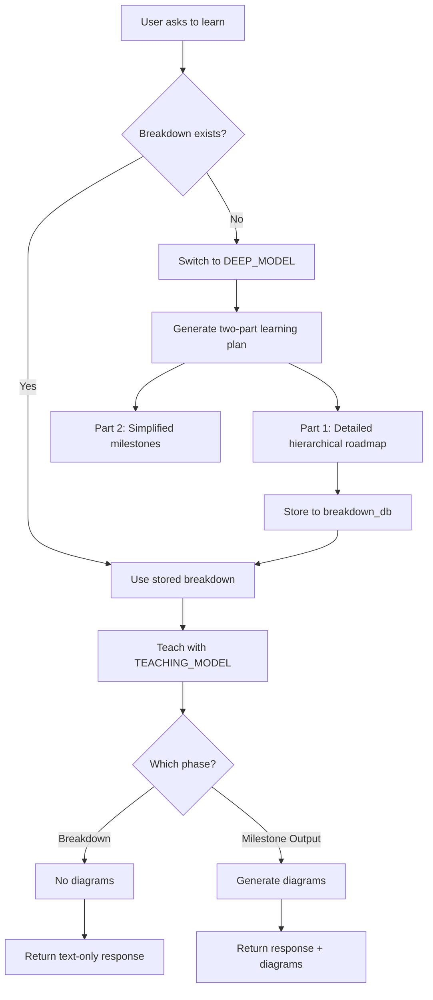

# Plan: Diagram/Image Generation Control + Model-Switch Mechanism

## Updated Requirements (from user feedback)

1. **Model configuration via .env**: Replace `LLM_MODEL` with `TEACHING_MODEL` and `DEEP_MODEL` in .env
2. **Agent config via .env**: `AGENT_NAME` and `AGENT_PERSONALITY` already in .env - use them
3. **Two-part learning plan**:
   - **Planning phase**: Detailed hierarchical learning roadmap (generated by DEEP_MODEL)
   - **Milestones phase**: Simplified milestones derived from the planning, used to teach (by TEACHING_MODEL)

---

## Feature 1: Diagram/Image Generation Control

### Goal

Control when diagrams/images are generated - only during milestone output phases, not during roadmap/breakdown generation.

### Implementation

#### 1.1 Add generation_mode to milestone store

- Add `generation_mode` field to `MilestonePlan` dataclass
- Values: `"breakdown"` (text-only) | `"milestone_output"` (diagrams allowed)
- Default: `"breakdown"`
- Store in SQLite with the plan

#### 1.2 Modify VisualPlanner to accept phase parameter

- Add `phase` parameter to `VisualPlanner.plan()` method
- When `phase == "breakdown"`: return empty visual plan (no diagrams)
- When `phase == "milestone_output"`: generate diagrams as normal

#### 1.3 Update Gateway to pass phase to visual planner

- Read `generation_mode` from milestone store for current topic
- Pass phase to `_generate_visual_plan()`

#### 1.4 Add API endpoint to set generation mode

- `POST /api/milestones/{plan_id}/generation-mode`
- Accepts `{"mode": "breakdown" | "milestone_output"}`
- Updates the milestone plan's generation_mode

---

## Feature 2: Model-Switch Mechanism for Milestone Breakdowns

### Goal

Use a stronger "deep thinking" model to generate the detailed roadmap once, then use a smaller model to teach from it.

### Implementation

#### 2.1 Update .env file

```env
# Replace LLM_MODEL with dual model config
TEACHING_MODEL=google/gemini-2.5-flash   # Smaller/faster model for teaching
DEEP_MODEL=google/gemini-2.0-flash       # Stronger model for detailed planning

# Agent config (already in .env, use from config)
AGENT_NAME=Agent
AGENT_PERSONALITY=personality.txt
```

#### 2.2 Update config.py to read from .env

- Remove hardcoded defaults for `llm_model`
- Add `teaching_model` and `deep_model` settings that read from env
- Keep `agent_name` and `agent_personality` reading from env

#### 2.3 Add LLM helper method for model switching

- Add `get_llm(model_key: str)` function to llm.py
- `model_key` can be: "teaching_model" or "deep_model"
- Returns LLM instance configured with the specified model

#### 2.4 Create BreakdownStore class

- New file: `backend/app/milestones/breakdown_store.py`
- Stores topic → breakdown mapping in SQLite
- Tables:
  - `breakdowns`: id, topic, content, version, created_at, updated_at
- Methods:
  - `get_breakdown(topic) -> Optional[dict]`
  - `set_breakdown(topic, content, version=1)`
  - `has_breakdown(topic) -> bool`

#### 2.5 Implement ensure_breakdown() function

```python
async def ensure_breakdown(topic: str, subject: str, grade_level: str) -> dict:
    # 1. Check if breakdown exists
    store = get_breakdown_store()
    if store.has_breakdown(topic):
        return store.get_breakdown(topic)

    # 2. Generate with DEEP_MODEL
    llm = get_llm("deep_model")
    breakdown = await _generate_breakdown_via_llm(llm, topic, subject, grade_level)

    # 3. Store and return
    store.set_breakdown(topic, breakdown)
    return breakdown
```

#### 2.6 Two-Part Learning Plan Generation

**Part 1: Planning (DEEP_MODEL)**

- Generate detailed hierarchical learning roadmap
- Structure: Subject → Topics → Subtopics → Learning Objectives
- Include: prerequisites, key concepts, common misconceptions, assessment criteria

**Part 2: Milestones (derived from Planning)**

- Extract 4-6 milestones from the detailed plan
- Each milestone is a simplified teaching unit
- Reference back to the detailed plan for depth

```python
async def _generate_breakdown_via_llm(llm, topic, subject, grade_level):
    """Generate detailed two-part learning plan."""
    prompt = f"""Create a comprehensive learning plan for '{topic}' in {subject}.

Generate TWO parts:

## PART 1: DETAILED PLANNING (comprehensive roadmap)
Create a hierarchical structure:
- Main topics and subtopics
- Prerequisites for each section
- Key concepts students must understand
- Common misconceptions to address
- Suggested assessment methods

## PART 2: MILESTONES (simplified teaching units)
Extract 4-6 milestones from the detailed plan above.
Each milestone should be a single, assessable learning objective.

Return as JSON:
{{
  "planning": {{"hierarchical_roadmap": "...", "prerequisites": [...], "key_concepts": [...], "misconceptions": [...], "assessment": "..."}},
  "milestones": [{{"title": "...", "description": "...", "order": 1}}]
}}

Grade level: {grade_level or 'general'}"""

    result = await llm.generate(messages=[{"role": "user", "content": prompt}])
    # Parse and return the structured breakdown
```

#### 2.7 Modify milestone_api.py to use model-switch

- Update `create_plan` endpoint to use `ensure_breakdown()`
- Extract milestones from the breakdown's "milestones" section
- Use `teaching_model` for subsequent teaching interactions

#### 2.8 Update teaching loop

- Gateway uses `teaching_model` for regular teaching
- Uses stored breakdown from `breakdown_store` for context

---

## Database Schema Changes

### New table: breakdowns

```sql
CREATE TABLE breakdowns (
    id INTEGER PRIMARY KEY AUTOINCREMENT,
    topic TEXT NOT NULL UNIQUE,
    content TEXT NOT NULL,
    version INTEGER DEFAULT 1,
    created_at REAL NOT NULL,
    updated_at REAL NOT NULL
);
```

### Modified: milestone_plans table

```sql
ALTER TABLE milestone_plans ADD COLUMN generation_mode TEXT DEFAULT 'breakdown';
```

---

## API Changes

### New Endpoints

1. `POST /api/milestones/{plan_id}/generation-mode` - Set generation mode
2. `GET /api/breakdowns/{topic}` - Get stored breakdown (optional)

### Modified Endpoints

1. `POST /api/milestones` - Now uses ensure_breakdown() with deep model, extracts milestones from breakdown

---

## Frontend Changes (Minimal)

1. Send `generation_mode` hint when calling milestone APIs
2. Handle `generation_mode` in WebSocket messages (ignore diagrams when in breakdown mode)

---

## Mermaid Diagram: Flow



---

## Files to Modify/Create

| File                                        | Action                                                  |
| ------------------------------------------- | ------------------------------------------------------- |
| `backend/.env`                              | Replace LLM_MODEL with TEACHING_MODEL and DEEP_MODEL    |
| `backend/app/core/config.py`                | Add teaching_model, deep_model settings (read from env) |
| `backend/app/core/llm.py`                   | Add get_llm(model_key) function                         |
| `backend/app/milestones/milestone_store.py` | Add generation_mode to MilestonePlan                    |
| `backend/app/milestones/breakdown_store.py` | NEW - BreakdownStore class                              |
| `backend/app/visuals/planner.py`            | Add phase parameter to plan()                           |
| `backend/app/agent/gateway.py`              | Pass phase to visual planner                            |
| `backend/app/api/milestone_api.py`          | Add generation-mode endpoint, use ensure_breakdown()    |

---

## Key Changes Summary

1. **.env**: `LLM_MODEL` → `TEACHING_MODEL` + `DEEP_MODEL`
2. **Config**: Read model names from env, not hardcoded
3. **Breakdown structure**: Now has two parts (planning + milestones)
4. **Generation control**: Via `generation_mode` state in milestone store
5. **Model switching**: `get_llm("teaching_model")` or `get_llm("deep_model")`
