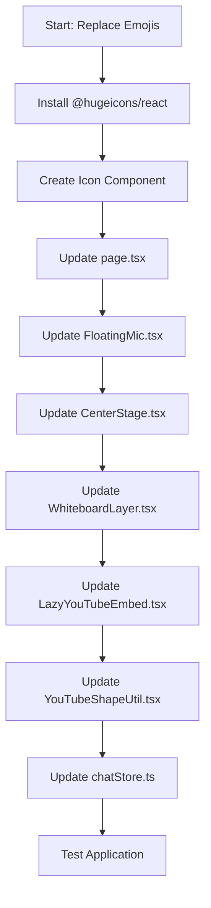

# Emoji Replacement Plan - Hugeicons Integration

## Overview

Replace all emojis in the AI Agent app with icons from the @hugeicons/react library.

## Emojis Found and Their Replacements

| Emoji | Usage                     | Hugeicon Name  | Component             |
| ----- | ------------------------- | -------------- | --------------------- |
| 📄    | Citation badge            | FileText02     | CitationBadge         |
| 🌐    | Scraped media header      | Globe01        | MediaCard             |
| 📂    | Document panel (dragging) | FolderOpen     | DocumentPanel         |
| 📎    | Document panel (default)  | Paperclip01    | DocumentPanel         |
| ✕     | Close buttons             | Close01        | Multiple              |
| 🎙️    | Microphone (idle)         | Microphone01   | FloatingMic           |
| ⏹     | Stop recording            | Stop01         | FloatingMic           |
| 🔊    | Speaking/volume on        | Speaker01      | FloatingMic, VoiceOrb |
| 🔇    | Mute                      | SpeakerMute01  | page.tsx              |
| 🔈    | Volume low                | Speaker02      | page.tsx              |
| 💬    | Chat mode                 | Chat01         | CenterStage           |
| 🎨    | Whiteboard mode           | Palette01      | CenterStage           |
| 📸    | Snapshot button           | Camera01       | WhiteboardLayer       |
| 📹    | YouTube placeholder       | Video01        | LazyYouTubeEmbed      |
| ▶     | YouTube play button       | Play01         | YouTubeShapeUtil      |
| ↗     | External link             | ArrowUpRight01 | MessageContent        |
| ✎     | Edit chat                 | Edit01         | page.tsx              |
| ☰    | Menu toggle               | Menu01         | page.tsx              |
| 📌    | Board link chips          | Pin01          | page.tsx              |

## Implementation Steps

### Step 1: Install @hugeicons/react

```bash
cd frontend && npm install @hugeicons/react
```

### Step 2: Create Icon Component

Create `frontend/src/components/Icon.tsx` that wraps Hugeicons with consistent styling.

### Step 3: Update Files

#### 3.1 frontend/src/app/page.tsx

- Line 119: 📄 → FileText02
- Line 142: 🌐 → Globe01
- Line 215: 📂/📎 → FolderOpen/Paperclip01
- Line 259: ✕ → Close01
- Line 294: 🔊 → Speaker01
- Line 370: 📌 → Pin01
- Line 575: ☰ → Menu01
- Line 615: 📎 → Paperclip01
- Line 726: ✎ → Edit01
- Line 733: ✕ → Close01
- Line 930: ⏹/🔊/🎙️ → Stop01/Speaker01/Microphone01
- Line 950: 🔈/🔇 → Speaker02/SpeakerMute01
- Line 999: ✕ → Close01

#### 3.2 frontend/src/components/FloatingMic.tsx

- Line 47: ⏹/🔊/🎙️ → Stop01/Speaker01/Microphone01

#### 3.3 frontend/src/components/CenterStage.tsx

- Line 41: 💬/🎨 → Chat01/Palette01

#### 3.4 frontend/src/components/whiteboard/WhiteboardLayer.tsx

- Line 42: 📸 → Camera01
- Line 79: 📸 → Camera01

#### 3.5 frontend/src/components/LazyYouTubeEmbed.tsx

- Line 92: 📹 → Video01

#### 3.6 frontend/src/components/whiteboard/YouTubeShapeUtil.tsx

- Line 77: ▶ → Play01
- Line 99: ✕ → Close01
- Line 160: ▶ → Play01

#### 3.7 frontend/src/store/chatStore.ts

- Line 198: 🌐 → Globe01

## Mermaid Diagram



## Notes

- All icons should use the same size and color styling as the original emojis
- The Hugeicons package provides both filled and outlined variants - use filled for consistency
- Some icons may need size adjustment (e.g., play button, close button)
